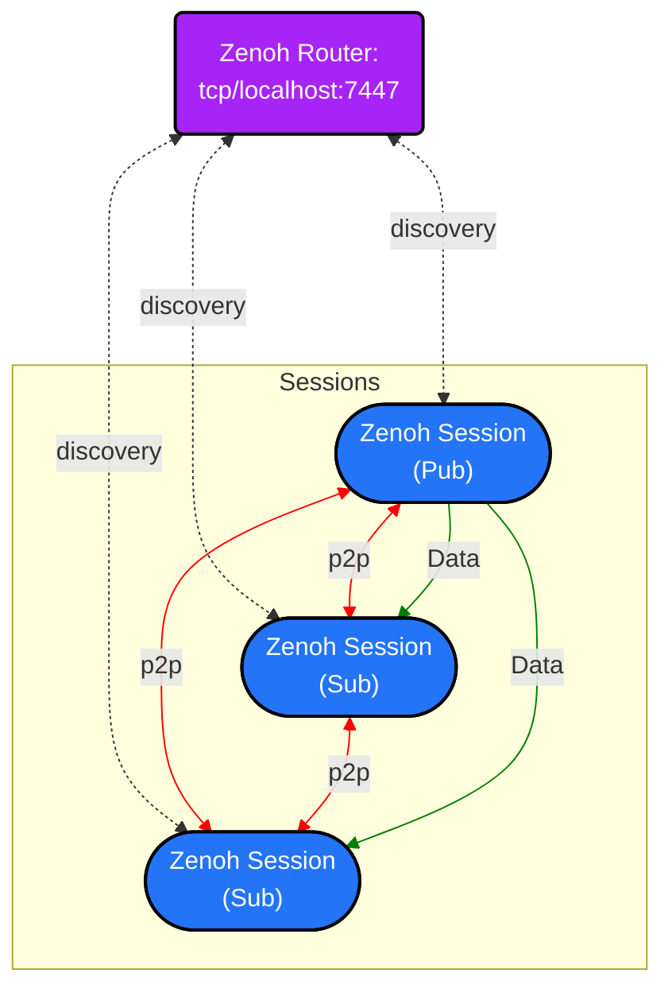

# Design

## Introduction

`rmw_zenoh_cpp` maps the ROS 2 [RMW API](https://github.com/ros2/rmw/tree/rolling/rmw/include/rmw) onto Zenoh APIs, using [zenoh-cpp](https://github.com/eclipse-zenoh/zenoh-cpp) and [zenoh-c](https://github.com/eclipse-zenoh/zenoh-c).
The end result is that users can use ROS 2 to send and receive data over Zenoh, using the APIs that they are already familiar with.

## Brief overview

There is more detail on each item below, but a brief overview on how this is accomplished is the following:

* It is assumed that a Zenoh router is running on the local system.  This router will be used for discovery and host-to-host communication.  However it is *not* used for intra-host communication (i.e., as a message broker); data is sent via direct peer-to-peer connections.
* Each "context" in ROS 2 is mapped to a single Zenoh "session".  That means that there may be many publishers, subscriptions, services, and clients sharing the same session.
* Every "context" has a local "graph cache" that keeps track of the details of the network graph of ROS 2 entities.
* Zenoh publishers, subscriptions, services, and clients are created or destroyed when the corresponding RMW APIs are called.
* Data is sent and received through the appropriate zenoh-cpp API when the corresponding RMW APIs are called.

The following diagram shows the default network topology of a subsystem composed of 3 nodes:



Default Configuration for Zenoh Sessions and Router:

| Config | Zenoh Session | Zenoh Router  |
| :---:           | :---:                | :---:            |
| Default config file  | [DEFAULT_RMW_ZENOH_SESSION_CONFIG.json5](../rmw_zenoh_cpp/config/DEFAULT_RMW_ZENOH_SESSION_CONFIG.json5) | [DEFAULT_RMW_ZENOH_ROUTER_CONFIG.json5](../rmw_zenoh_cpp/config/DEFAULT_RMW_ZENOH_ROUTER_CONFIG.json5) |
| Environment variable | `ZENOH_SESSION_CONFIG_URI` | `ZENOH_ROUTER_CONFIG_URI` |
| Mode                 | peer                       | router                    |
| Listen               | `tcp/localhost:0`          | `tcp/[::]:7447`           |
| Connect              | `tcp/localhost:7447`       | -                         |
| Gossip Scouting      | Enabled                    | Enabled                   |
| UDP Multicast        | Disabled                   | Disabled                  |

**The Router** is listening for incoming TCP connections port 7447 for all available interfaces (`tcp/[::]:7447`).

**The Sessions** connect to the local Router via the loopback interface (`tcp/localhost:7447`). They also listen for incoming TCP connections via the loopback on a port chosen by the OS (`tcp/localhost:0`).

**The Gossip Scouting** protocol is enabled to allow the router to discover the endpoints (IP:port) used by each connecting Session and to forward those endpoints to the other Sessions. As a result, Sessions can create peer-to-peer connections over the loopback interface.

**The UDP Multicast** Scouting is disabled by default. The decision to not rely on UDP multicast for discovery was intentional, aimed at avoiding issues with misconfigured networks, operating systems, or containers. It also helps prevent uncontrolled communication between robots in the same LAN, which could lead to interferences if not properly configured with different `ROS_DOMAIN_ID` or namespaces.


## Router

With the default configuration, `rmw_zenoh_cpp` relies on a Zenoh router to discover peers and forward this discovery information to other peers via Zenoh's `gossip scouting` functionality.
Hence `rmw_zenoh_cpp` requires the Zenoh router to be running.

It should be noted that when building upstream Zenoh from source, a `zenohd` binary is created which is the router.
`rmw_zenoh_cpp` has its own simplified version of the router that nonetheless uses most of the same code.
This was done so that Zenoh didn't have to be vendored twice (once for zenoh-cpp and once for zenohd), and so that the router could be more easily integrated into the ROS 2 package format.

As of 2024-02-09, the user is expected to launch the router by hand.
In order to integrate more seamlessly into ROS 2, the Zenoh router can be launched by running `ros2 run rmw_zenoh_cpp rmw_zenohd`.
The default configuration that the router uses is located in [DEFAULT_RMW_ZENOH_ROUTER_CONFIG.json5](../rmw_zenoh_cpp/config/DEFAULT_RMW_ZENOH_ROUTER_CONFIG.json5).
The user can use a custom configuration by setting the `ZENOH_ROUTER_CONFIG_URI` environment variable to point to a valid [Zenoh configuration file](https://github.com/eclipse-zenoh/zenoh/blob/main/DEFAULT_CONFIG.json5).

In the future, additional work may be done to automatically launch a Zenoh router if one isn't already running.

## Serialization/Deserialization

By default, Zenoh doesn't specify a serialization format; it just delivers bags of bytes.
There are quite a few serialization formats that `rmw_zenoh_cpp` could use, including protobuf, CDR, Cap'n Proto, JSON, etc.
In the current design, `rmw_zenoh_cpp` uses CDR as the serialization format for the following reasons:

* Using CDR means that data can be bridged between Zenoh and DDS without a deserialization/serialization step.
* Using CDR means that a new typesupport doesn't have to be developed, which is its own project.

### Related RMW APIs

* rmw_get_serialized_message_size
* rmw_serialize
* rmw_deserialize

### Related Zenoh APIs

N/A

## Topic and Service name mapping to Zenoh key expressions

Zenoh inherently allows any pub/sub or querier/queryable pair to communicate, irrespective of their data type, encoding, or QoS, as long as their key expressions match.

In contrast, to ensure `rmw_zenoh_cpp` aligns with the behavior of other RMW implementations, its key expressions have been specifically designed to

* Prevent any communication between Sessions using different `ROS_DOMAIN_ID`, even when they are connecting to the same Zenoh infrastructure (i.e., interconnected routers).
* Prevent any communication between Publishers and Subscribers that use the same topic name but have different type names or type definitions. This also applies to Service Servers and Clients.

The format of key expressions for topics and services is:

`<domain_id>/<fully_qualified_name>/<type_name>/<type_hash>`

Where:

* `<domain_id>` - The value of the `ROS_DOMAIN_ID` environment variable (`0` by default)
* `<fully_qualified_name>` - The [fully qualified name](https://design.ros2.org/articles/topic_and_service_names.html#fully-qualified-names) of the topic or service (i.e. including namespace, if any)
* `<type_name>` - The topic or service type name, as declared in DDS (e.g.: `std_msgs::msg::dds_::String_`) when encoded in CDR
* `<type_hash>` - the topic or service type hash, as defined in [REP-2016](https://github.com/ros-infrastructure/rep/pull/381/files) and generated by [`rosidl`](https://github.com/ros2/rosidl/tree/rolling/rosidl_generator_type_description)

Examples using the `demo_nodes_cpp` package:

* `chatter` topic (with `ROS_DOMAIN_ID=0` by default):

  ```text
  0/chatter/std_msgs::msg::dds_::String_/RIHS01_df668c740482bbd48fb39d76a70dfd4bd59db1288021743503259e948f6b1a18
  ```

* `chatter` topic, using `/robot1` as a namespace:

  ```text
  0/robot1/chatter/std_msgs::msg::dds_::String_/RIHS01_df668c740482bbd48fb39d76a70dfd4bd59db1288021743503259e948f6b1a18
  ```

* `add_two_ints` service with `DOMAIN_ID=2`:

  ```text
  2/add_two_ints/example_interfaces::srv::dds_::AddTwoInts_/RIHS01_e118de6bf5eeb66a2491b5bda11202e7b68f198d6f67922cf30364858239c81a
  ```

### Related RMW APIs

* TopicInfo

### Related Zenoh APIs

N/A

## Graph Cache

One of the biggest impedance mismatches between Zenoh and ROS 2 has to do with graph introspection.
Zenoh attempts to do the absolute minimum of discovery (for performance reasons), while ROS 2 generally assumes that the entire graph is available from all entities in the system (for debugging/introspection reasons).
To deal with this discrepancy, each context in `rmw_zenoh_cpp` keeps a cache of all entities discovered in the graph so far.
An "entity" is a node, publisher, subscription, service server, or service client.
Each entity sends a unique liveliness token as it comes online, and removes that liveliness token when it is destroyed.
The key expression of these liveliness tokens encode information about the entity and it's relationship to the other entities in the system (for instance, a publisher is always attached to a node within a certain namespace).

The format of a liveliness token for a node is:

```text
@ros2_lv/<domain_id>/<session_id>/<node_id>/<node_id>/<entity_kind>/<mangled_enclave>/<mangled_namespace>/<node_name>
```

The format of a liveliness token for a publisher, subscription, service server, or service client:

```text
@ros2_lv/<domain_id>/<session_id>/<node_id>/<entity_id>/<entity_kind>/<mangled_enclave>/<mangled_namespace>/<node_name>/<mangled_qualified_name>/<type_name>/<type_hash>/<qos>
```

Where:

* A mangled name is the name with each `/` characters replaced by `%`
* `@ros2_lv` - A constant prefix marking a [Zenoh hermetic namespace](https://github.com/eclipse-zenoh/roadmap/blob/main/rfcs/ALL/Key%20Expressions.md#namespaces) (i.e. `*` or `**` never match this perfix chunk)
* `<domain_id>` - The value of the `ROS_DOMAIN_ID` environment variable (`0` by default)
* `<session_id>` - The Zenoh session ID (only one session per-context)
* `<node_id>` - The ID of the node within the context
* `<entity_id>` - The ID of the entity within the node
* `<entity_kind>` - The kind of the entity. Possible values:
  * `NN` for a node
  * `MP` for a message publisher
  * `MS` for a message subscription
  * `SS` for a service server
  * `SC` for a service client
* `<mangled_enclave>` - The mangled SROS enclave name (just `%` if not set)
* `<mangled_namespace>` - The mangled namespace (just `%` if not set)
* `<node_name>` - The node name
* `<mangled_qualified_name>` - The mangled [fully qualified name](https://design.ros2.org/articles/topic_and_service_names.html#fully-qualified-names) of the topic or service (i.e. including namespace, if any)
* `<type_name>` - The topic or service type name, as declared in DDS (e.g.: `std_msgs::msg::dds_::String_`) when encoded in CDR
* `<type_hash>` - the topic or service type hash, as defined in [REP-2016](https://github.com/ros-infrastructure/rep/pull/381/files) and generated by [`rosidl`](https://github.com/ros2/rosidl/tree/rolling/rosidl_generator_type_description)
* `<qos>` - The entity QoS encoded in a compact format (see the `qos_to_keyexpr` function)

During context initialization, `rmw_zenoh_cpp` calls `Session::liveliness_get` to get an initial view of the entire graph from other nodes in the system.
From then on, when entities enter and leave the system, `rmw_zenoh_cpp` will get new liveliness tokens that it can use to update its internal cache.

Examples using the demo_nodes_cpp package:

* `listener` node (with `ROS_DOMAIN_ID=0` by default):

  ```text
  @ros2_lv/2/aac3178e146ba6f1fc6e6a4085e77f21/0/0/NN/%/%/listener
  ```

* `listener` node's subscription on `chatter` topic:

  ```text
  @ros2_lv/2/aac3178e146ba6f1fc6e6a4085e77f21/0/10/MS/%/%/listener/%chatter/std_msgs::msg::dds_::String_/RIHS01_df668c740482bbd48fb39d76a70dfd4bd59db1288021743503259e948f6b1a18/::,10:,:,:,,
  ```

* `talker` node's publisher on `chatter` topic:

  ```text
  @ros2_lv/2/8b20917502ee955ac4476e0266340d5c/0/10/MP/%/%/talker/%chatter/std_msgs::msg::dds_::String_/RIHS01_df668c740482bbd48fb39d76a70dfd4bd59db1288021743503259e948f6b1a18/::,7:,:,:,,
  ```

* `add_two_ints_server` node's service server:

  ```text
  @ros2_lv/2/f9980ee0495eaafb3e38f0d19e2eae12/0/10/SS/%/%/add_two_ints_server/%add_two_ints/example_interfaces::srv::dds_::AddTwoInts_/RIHS01_e118de6bf5eeb66a2491b5bda11202e7b68f198d6f67922cf30364858239c81a/::,10:,:,:,,
  ```

* `add_two_ints_client` node's service client:

  ```text
  @ros2_lv/2/e1dc8d1b45ae8717fce78689cc655685/0/10/SC/%/%/add_two_ints_client/%add_two_ints/example_interfaces::srv::dds_::AddTwoInts_/RIHS01_e118de6bf5eeb66a2491b5bda11202e7b68f198d6f67922cf30364858239c81a/::,10:,:,:,,
  ```


### Related RMW APIs

* Entity
* rmw_publisher_count_matched_subscriptions
* rmw_subscription_count_matched_publishers
* rmw_get_node_names
* rmw_get_node_names_with_enclaves
* rmw_count_publishers
* rmw_count_subscribers
* rmw_count_clients
* rmw_count_services
* rmw_get_gid_for_publisher
* rmw_get_gid_for_client
* rmw_compare_gids_equal
* rmw_get_service_names_and_types
* rmw_get_publishers_info_by_topic
* rmw_get_subscriptions_info_by_topic
* rmw_get_subscriber_names_and_types_by_node
* rmw_get_publisher_names_and_types_by_node
* rmw_get_service_names_and_types_by_node
* rmw_get_client_names_and_types_by_node
* rmw_get_topic_names_and_types
* mangle_name
* qos_to_keyexpr

### Related Zenoh APIs

* Session::liveliness_declare_token
* Session::liveliness_declare_subscriber
* Session::liveliness_get

## Contexts

A ROS 2 context describes a certain middleware configuration, which can contain 0 or more ROS 2 nodes.
In `rmw_zenoh_cpp`, a context maps to a Zenoh session, along with a subscription to liveliness tokens for the graph cache and some additional metadata.

Zenoh allows sessions to be custom configured through a configuration file.
If otherwise unconfigured, `rmw_zenoh_cpp` uses a [default configuration file](../rmw_zenoh_cpp/config/DEFAULT_RMW_ZENOH_SESSION_CONFIG.json5).
The user can use a custom configuration by setting the `ZENOH_SESSION_CONFIG_URI` environment variable to point to a valid [Zenoh configuration file](https://github.com/eclipse-zenoh/zenoh/blob/main/DEFAULT_CONFIG.json5).

### Related RMW APIs

* rmw_context_impl_s
* rmw_context_impl_s::Data
* rmw_get_zero_initialized_init_options
* rmw_init_options_copy
* rmw_init_options_fini
* rmw_get_zero_initialized_context
* rmw_init
* rmw_shutdown
* rmw_create_guard_condition
* rmw_destroy_guard_condition
* rmw_trigger_guard_condition
* rmw_create_wait_set
* rmw_destroy_wait_set
* rmw_wait

### Related Zenoh APIs

* Session::open
* Session::liveliness_declare_subscriber
* Session::liveliness_get
* Session::close

## Namespaces

ROS 2 has a concept of "namespaces", where everything under that namespace has an additional prefix added to all names.
Because of this, namespaces are not separate "entities" in a ROS 2 graph.

Zenoh doesn't directly have a concept of a namespace; instead, everything is under a single global namespace, but can be partitioned by using `/` in topic and queryable names.

To map the ROS 2 concept of namespaces onto Zenoh, all entity liveliness tokens encode the namespace.
Since Zenoh liveliness tokens cannot be empty, in the case of an empty namespace (the default), a namespace of `%` is used.

## Nodes

A ROS 2 node can be though of as the "unit of computation" in a ROS 2 graph; usually one node performs one particular task.
Nodes may contain publishers, subscriptions, service servers, service clients, action servers, action clients, parameters, and anything else needed to do some computation.
Zenoh has no conceptual equivalent to the ROS 2 node, so `rmw_zenoh_cpp` creates no Zenoh entities when nodes are created.

When a new node is created through the RMW API, a liveliness token of type `NN` is sent out.

### Related RMW APIs

* NodeData
* rmw_create_node
* rmw_destroy_node
* rmw_node_get_graph_guard_condition

### Related Zenoh APIs

* Session::liveliness_declare_token

## Publishers

A ROS 2 publisher sends data to 0 or more connected subscriptions.
A Zenoh publisher does exactly the same thing, so ROS 2 publishers are mapped onto Zenoh publishers in `rmw_zenoh_cpp`.
For certain Quality of Service features, the Zenoh advanced publisher API is used.
For instance, if the Quality of Service durability for a publisher is `TRANSIENT_LOCAL`, a Zenoh advanced publisher will be created with a publication cache.
See the [Quality of Service](#Quality-of-Service) section below for more information.

When a new publisher is created, a liveliness token of type `MP` is sent out.

A ROS 2 Publisher publishes messages calling the Zenoh `put` operation with:

* the key expression mapped from the topic name
* the serialized message
* an attachment containing a sequence number, a source timestamp and publisher GID. It is encoded as such:
  * 8 bytes for the sequence number (int64_t), encoded as a little-endian
  * 8 bytes for the timestamp (number of ns since UNIX EPOCH as int64_t), encoded as a little-endian
  * 1 byte for the length of the publisher GID (currently always 16)
  * 16 bytes for the publisher GID (array of 16 int8_t)

### Related RMW APIs

* rmw_create_publisher
* PublisherData
* PublisherData::publish
* PublisherData::publish_serialized_message
* AttachmentData
* rmw_destroy_publisher
* rmw_borrow_loaned_message
* rmw_return_loaned_message
* rmw_publisher_wait_for_all_acked
* rmw_publisher_get_network_flow_endpoints
* rmw_publisher_event_init

### Related Zenoh APIs

* Session::liveliness_declare_token
* Session::declare_advanced_publisher
* SessionExt::AdvancedPublisherOptions
* AdvancedPublisher::put

## Subscriptions

A ROS 2 subscription receives data from 1 or more connected publishers.
A Zenoh subscriber does exactly the same thing, so ROS 2 subscriptions are mapped onto Zenoh subscribers in `rmw_zenoh_cpp`.
For certain Quality of Service features, the Zenoh advanced subscriber API is used.
For instance, if the Quality of Service durability for a subscription is `TRANSIENT_LOCAL`, a Zenoh advanced publisher will be created with options to query the historical data cached by the advanced publishers.
See the [Quality of Service](#Quality-of-Service) section below for more information.

When new data arrives, a callback within `rmw_zenoh_cpp` is executed, which takes ownership of the data and signals that there is data available.
Then `rmw_wait` can find out that there is data available, and the data can be delivered via `rmw_take`.

When a new subscription is created, a liveliness token of type `MS` is sent out.

### Related RMW APIs

* rmw_create_subscription
* SubscriptionData
* rmw_destroy_subscription
* rmw_take
* rmw_take_with_info
* rmw_take_sequence
* rmw_take_serialized_message
* rmw_take_serialized_message_with_info
* rmw_wait
* rmw_subscription_set_on_new_request_callback
* rmw_subscription_set_content_filter
* rmw_subscription_get_content_filter
* rmw_take_loaned_message
* rmw_take_loaned_message_with_info
* rmw_return_loaned_message_from_subscription
* rmw_subscription_get_network_flow_endpoints
* rmw_subscription_event_init

### Related Zenoh APIs

* Session::liveliness_declare_token
* Session::declare_advanced_subscriber
* SessionExt::AdvancedSubscriberOptions
* Sample

## Service Clients

In ROS 2, services are meant to be used for remote procedure calls that will return fairly quickly.
`rmw_zenoh_cpp` uses Zenoh queryables to implement ROS 2 services.
When a client wants to make a request, it uses the rmw API `rmw_send_request`.

A ROS 2 service client sends a request calling the Zenoh `get` operation with:

* the key expression mapped from the service name
* the serialized request
* an attachment containing a sequence number, a source timestamp and client GID. It is encoded as such:
  * 8 bytes for the sequence number (int64_t), encoded as a little-endian
  * 8 bytes for the timestamp (number of ns since UNIX EPOCH as int64_t), encoded as a little-endian
  * 1 byte for the length of the client GID (currently always 16)
  * 16 bytes for the client GID (array of 16 int8_t)
* the target option set to `ALL_COMPLETE`, as queryable for service servers are declared as complete

The sequence number is used to correlate this request to the response that comes back later.

Assuming there is a service server listening to that queryable, it will receive the request, perform a computation, and return the response.
The response will then be made available to the client via `rmw_take_response`.

When a new service client is created, a liveliness token of type `SC` is sent out.

### Related RMW APIs

* rmw_create_client
* ClientData
* AttachmentData
* ZenohReply
* rmw_destroy_client
* rmw_send_request
* rwm_take_response
* rmw_take
* rmw_take_with_info
* rmw_take_sequence
* rmw_take_serialized_message
* rmw_take_serialized_message_with_info
* rmw_wait
* rmw_service_server_is_available
* rmw_client_set_on_new_response_callback

### Related Zenoh APIs

* Session::liveliness_declare_token
* Session::get
* Session::GetOptions
* Reply

## Service Servers

In ROS 2, services are meant to be used for remote procedure calls that will return fairly quickly.
`rmw_zenoh_cpp` uses Zenoh queryables to implement ROS 2 services.
When a ROS 2 node wants to advertise a service to the network, it calls `rmw_create_service`.
`rmw_zenoh_cpp` uses the `declare_queryable` Zenoh API to create that service. The queryable is declared with the key expression mapped from the service name. As this key expression doesn't contain wildcards (`*` or `**`) the queryable is declared as complete (i.e. it can send a reply for every request).

When a client request comes in, `rmw_take_request` is called to send the query to the user callback, which should perform some computation.
Once the user callback returns, `rmw_send_response` is called to send the response back to the requester. This response is sent using the Zenoh `reply` operation with:

* the serialized response
* an attachment containing the sequence number received in the request attachment, a source timestamp for the reply and the client GID received in the request attachment. It is encoded as such:
  * 8 bytes for the sequence number (int64_t), encoded as a little-endian
  * 8 bytes for the timestamp (number of ns since UNIX EPOCH as int64_t), encoded as a little-endian
  * 1 byte for the length of the client GID (currently always 16)
  * 16 bytes for the client GID (array of 16 int8_t)

When a new service server is created, a liveliness token of type `SS` is sent out.

### Related RMW APIs

* rmw_create_service
* ServiceData
* AttachmentData
* ZenohQuery
* rmw_destroy_service
* rmw_take_request
* rmw_send_response
* rmw_take
* rmw_take_with_info
* rmw_take_sequence
* rmw_take_serialized_message
* rmw_take_serialized_message_with_info
* rmw_wait

### Related Zenoh APIs

* Session::liveliness_declare_token
* Session::declare_queryable
* Session::QueryableOptions
* Query
* Query::reply
* Query::ReplyOptions

## Quality of Service

The ROS 2 RMW layer defines quite a few Quality of Service settings that are largely derived from DDS.
Here is an incomplete list of some of the settings and the values that they can take, along with some details on how they are mapped in `rmw_zenoh_cpp`:

* `RELIABILITY`
    * `RELIABLE` - Applicable only for publishers. Data delivery is via a reliable transport (e.g. `tcp` or `quic`), if such endpoints are configured.
    * `BEST_EFFORT` - Data may be dropped during delivery. If non-reliable endpoints are configured (e.g. `udp`) they will be used. Otherwise a reliable transport will be used. Note that with the default configuration, only the TCP transport is configured. This is also the `SYSTEM_DEFAULT` reliability.
* `HISTORY`
    * `KEEP_LAST` - For subscriptions, only keep up to a maximum number of samples (defined by `DEPTH`); once the maximum is reached, older samples will be lost. For publications, if `TRANSIENT_LOCAL` is set, the `DEPTH` will define the size of the publication cache. This is the `SYSTEM_DEFAULT` history.
    * `KEEP_ALL` - For subscriptions, keep all values. For publishers, if the `RELIABILITY` is `RELIABLE`, the `CongestionControl::BLOCK` mode is set, meaning the publisher will be blocked when network congestion occurs. This allows a periodic publisher to adapt its publication rate to what the network or the subscriptions can handle.
* `DEPTH` - The maximum number of samples to keep; this only comes into play when `KEEP_LAST` history is used.  If `DEPTH` is set to 0, `rmw_zenoh_cpp` will choose a depth of 42.
* `DURABILITY`
    * `VOLATILE` - Samples will only be delivered to subscriptions that are active at the time of publishing. This is the `SYSTEM_DEFAULT` durability.
    * `TRANSIENT_LOCAL` - "Late-joining" subscriptions will receive historical data, along with any new data.  In `rmw_zenoh_cpp`, this is implemented for publishers via the activation of a cache on the `AdvancedPublisher`. On the subscription side the `AdvancedSubscriber` is configured to query this cache to retrieve the historical data.
* `LIVELINESS`
    * `AUTOMATIC` - The "liveliness" of an entity of the system is managed by the RMW layer.  This is the only `LIVELINESS` that `rmw_zenoh_cpp` supports.
    * `MANUAL_BY_TOPIC` - Not supported. It is up to the application to periodically publish to a particular topic to assert liveliness.
* `DEADLINE` - The period at which messages are expected to be sent/received.  Currently unimplemented in `rmw_zenoh_cpp`.
* `LIFESPAN` - The age at which messages are expired and no longer valid.  Currently unimplemented in `rmw_zenoh_cpp`.

In Zenoh, there are essentially no "incompatible" Quality of Service settings.
This means that any publisher can match any subscription.

### Related RMW APIs

* rmw_publisher_get_actual_qos
* rmw_subscription_get_actual_qos
* rmw_client_request_publisher_get_actual_qos
* rmw_client_response_subscription_get_actual_qos
* rmw_service_request_subscription_get_actual_qos
* rmw_service_response_publisher_get_actual_qos

### Related Zenoh APIs

N/A

## Events

A ROS 2 RMW may communicate information not directly concerned with communication by using "events".
For instance, if a message is lost, then the RMW layer may raise an event to the upper layers to signal that fact.

Events are broken down into subscription events and publisher events:

* Subscription
    * `LIVELINESS_CHANGED`
    * `DEADLINE_MISSED`
    * `QOS_INCOMPATIBLE`
    * `MESSAGE_LOST`
    * `INCOMPATIBLE_TYPE`
    * `MATCHED`
* Publisher
    * `LIVELINESS_LOST`
    * `DEADLINE_MISSED`
    * `QOS_INCOMPATIBLE`
    * `INCOMPATIBLE_TYPE`
    * `MATCHED`

### Related RMW APIs

* rmw_wait
* rmw_take
* rmw_event_set_callback
* rmw_publisher_event_init
* rmw_subscription_event_init
* rmw_take_event

### Related Zenoh APIs

N/A

## Actions

As of 2024-02-09, there is no concept of an action at the RMW level in ROS 2.
Instead, actions are composed of several services and publishers/subcriptions.
Thus, there is no direct implementation of actions in `rmw_zenoh_cpp`.

## Security

TBD
